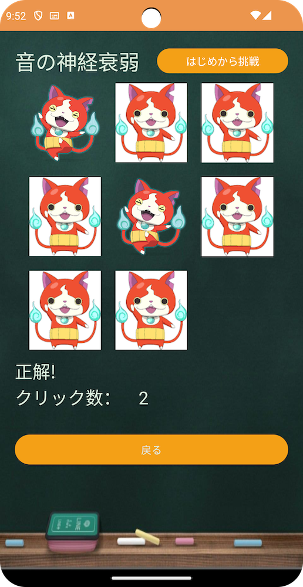

# 同じ音声に基づくカードのペアを見つけるゲーム

これは同じ音声に基づくカードのペアを見つけるゲームです。以下に、ゲームの開始画面とシンプルモードのゲーム画面の画像があります。

## 画像の例

### 画像1：開始画面

この画像には、シンプルとハードの2つのボタンが表示されています。これらはゲームを開始する難易度を選択するために使用されます。

### 画像2：シンプルモードのゲーム画面

この画像はシンプルモードのゲーム画面を示しており、プレイヤーがカードのペアを見つます。

## アプリ概要

このプロジェクトは、同じ音声に基づくカードのペアを見つけるゲームを提供しています。開始画面で難易度を選択することができます。

お楽しみください！
